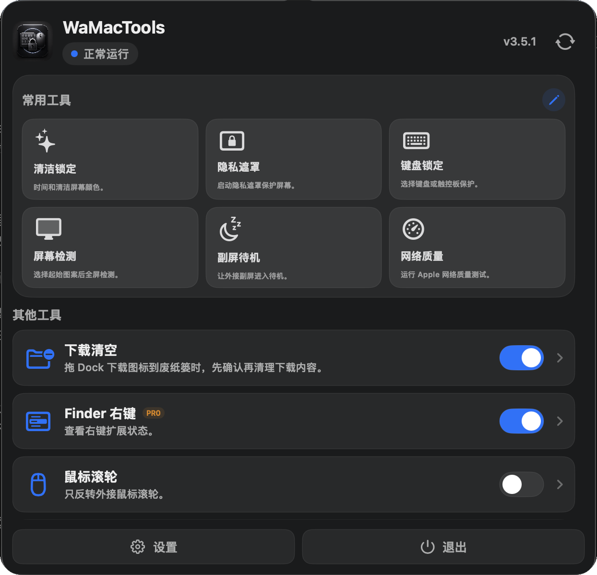

  

<h1 align="center">WaMacTools</h1>

  Official downloads for the WaMacTools macOS menu-bar toolbox.

  <a href="https://mac.wanan7.top"><strong>Official Website</strong></a>
  ·
  <a href="README.zh-CN.md">简体中文</a>
  ·
  <a href="https://github.com/iFaNGMiNGi/Wamactools/releases/latest">Latest Release</a>

  
  
  

## Download

Download the latest DMG from:

- [Official website](https://mac.wanan7.top)
- [GitHub Releases](https://github.com/iFaNGMiNGi/Wamactools/releases/latest)

Requires macOS 14.2 or later.

## What It Does

WaMacTools is a native macOS menu-bar toolbox for cleaning, privacy, display checks, and everyday Mac workflows:

- protect keyboard, trackpad and mouse input with Clean Lock and Keyboard Lock;
- cover all displays with Privacy Cover Pro while background tasks keep running;
- run fullscreen checks for dead pixels, light leak, gradients and contrast;
- try Display Standby Pro Beta for external-display standby;
- use Bluetooth Unlock Pro, Sleep Timer, Network Quality, Background Apps, Finder right-click tools, Window Layout, Device Battery, Mouse Wheel and Downloads cleanup guard from the menu-bar panel.

## Repository Scope

This public repository is for official downloads, release notes and issue entry only.

It does not contain the application source code, build scripts, signing setup, licensing backend or private release workflow.

## Safety

Only download WaMacTools from the official website or this official release repository. Do not install repackaged builds from unknown sources.

## License And Brand

WaMacTools, its icon, screenshots, website, update feed and product identity are protected brand assets. See [TRADEMARK.md](TRADEMARK.md).
