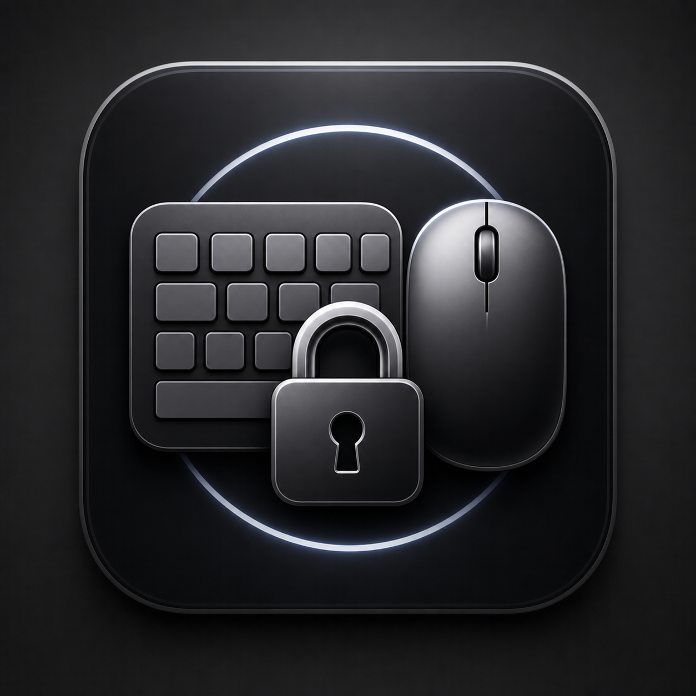
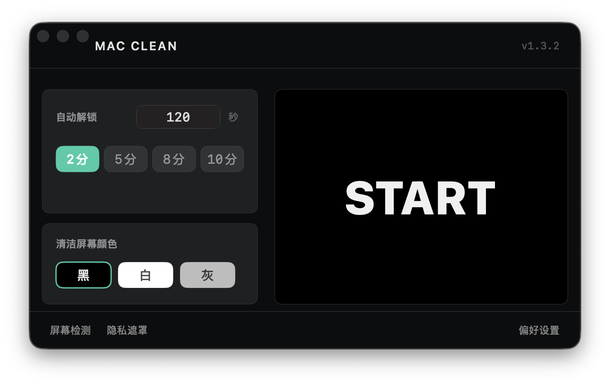

  

<h1 align="center">Mac Clean</h1>

  macOS 擦屏锁定、键盘清洁、隐私遮罩与屏幕检测工具官方下载仓库。

  <a href="https://mac.wanan7.top"><strong>官方网站</strong></a>
  ·
  <a href="README.md">English</a>
  ·
  <a href="https://github.com/iFaNGMiNGi/MacClean/releases/latest">最新版本</a>

  
  
  

## 下载

从以下位置下载最新 DMG：

- 官方网站：https://mac.wanan7.top
- GitHub Releases：https://github.com/iFaNGMiNGi/MacClean/releases/latest

需要 macOS 14.2 或更高版本。

## 功能

Mac Clean 是原生 macOS 小工具，适合清洁和临时隐私保护场景：

- 清洁 Mac 时锁定键盘、触控板和鼠标；
- 用隐私遮罩 Pro 盖住所有显示器，同时让后台任务继续运行；
- 用副屏待机 Pro Beta 让外接显示器尝试进入省电待机；
- 全屏检测坏点、漏光、色阶、渐变和对比度。

## 仓库范围

这个公开仓库只用于官方下载、版本说明和问题入口。

它不包含应用源码、构建脚本、签名配置、授权后台或私有发布流程。

## 安全提醒

请只从官方网站或这个官方 Release 仓库下载 Mac Clean。不要安装未知来源重新打包的版本。

## 授权与品牌

Mac Clean 名称、图标、截图、官网、更新源和产品标识均为受保护的品牌资产。请查看 [TRADEMARK.md](TRADEMARK.md)。
